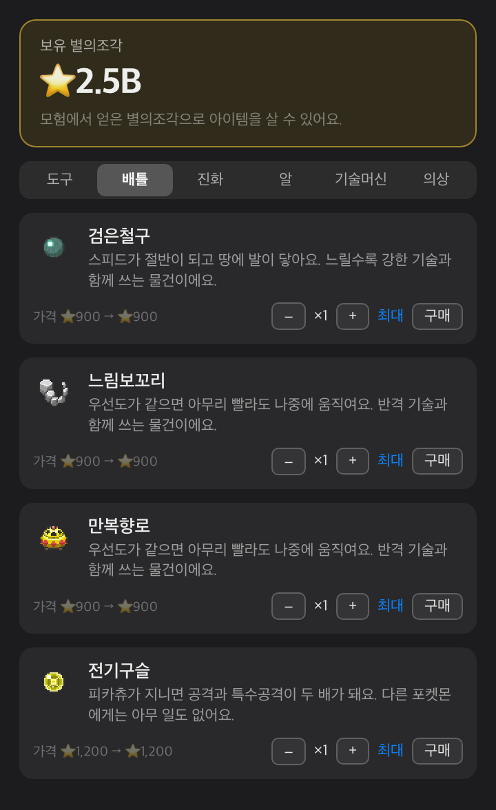
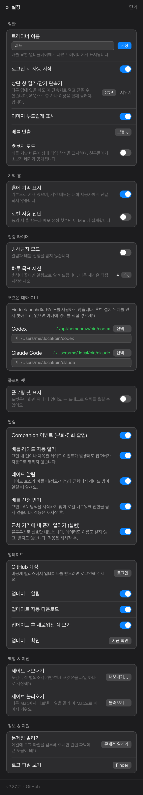
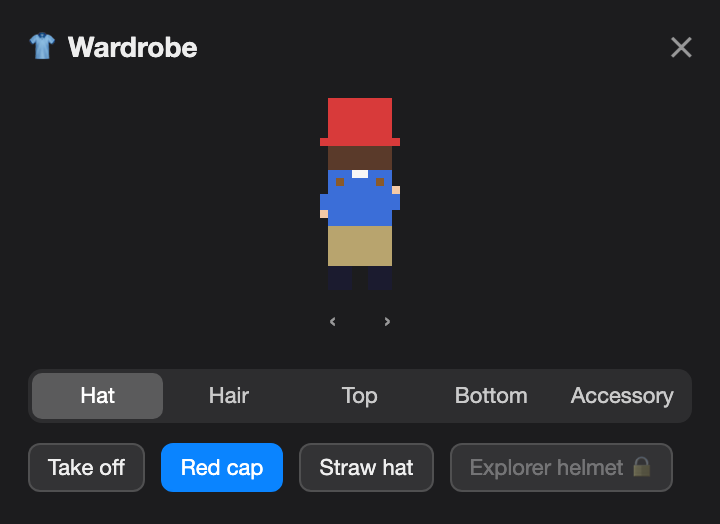
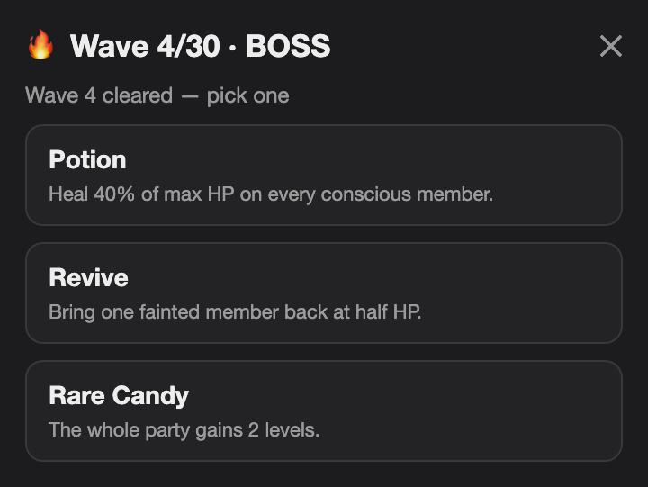
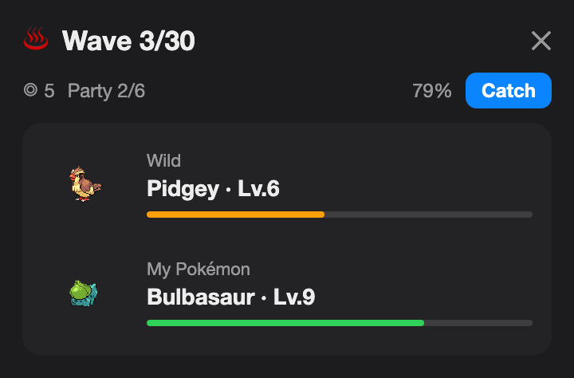

<div align="center">


# Pokédoro

**A macOS menu-bar game that pairs Pomodoro focus with Pokémon adventures.**

[](https://www.apple.com/macos/)
[](https://swift.org)
[](LICENSE)

**English** · [한국어](README.md) · [日本語](README.ja.md)

</div>

Pokédoro sends your Pokémon partner on an adventure while you focus, then lets you battle or play Pokéathlon with the Pokémon you collect. The menu bar normally shows `Resting` or the timer, so it fits naturally into a workday.

> An unofficial, non-commercial Pokémon fan project. Pokémon data and sprites are fetched at runtime from [PokéAPI](https://pokeapi.co/).

## How it works

1. Choose a 25-, 50-, or 90-minute focus session and send your current partner on an adventure of the same length.
2. When the adventure is complete, claim its reward. Claiming grants experience and Star Pieces; longer sessions grant more. Merely leaving the app open records app time, but does not grant Star Pieces automatically.
3. Each completed session awards egg fragments and has a chance to find a Mystery Egg. Ten fragments make an egg; the first adventure of the day grants an extra fragment, and ten adventures in a week grant a bonus egg.
4. Use experience to level your partner, and spend Star Pieces in the shop or as ranked-battle stakes. Home also tracks daily and weekly missions for adventure claims, focus time, and graduations; Pokédex goals reward collecting species, types, and shinies.

You can enable Do Not Disturb to block system notifications, the floating pet, and incoming battle challenges while you focus.

## Battle & Pokéathlon

- **LAN battles** — discover people on the same local network with Bonjour, send a challenge, and have the other player accept it manually. A received challenge can raise a notification; during a battle the window stays pinned open.
- **Practice and ranked battles** — practice against the CPU in 1v1, 3v3, or 6v6 with a chosen team and order. Ranked LAN battles normalize Pokémon to Lv.50; CPU practice uses the levels you raised.
- **Battle rules** — type matchups, STAB, physical and special stats, accuracy, critical hits, PP, move priority, six status conditions, and confusion are supported.
- **Gyms and stat stages** — challenge eight type gyms in 3v3. Every first clear pays Star Pieces and one egg, and the Dragon Gym's egg is guaranteed to be uncommon or better. Clearing all eight grants one shiny egg charge. Attack, Defense, Sp. Atk, Sp. Def, Speed, accuracy, and evasion can change during battle; switching resets those stages.
- **Team battles and turn playback** — LAN battles also use the team and order you choose. Resolved turns play step by step, with playback speed configurable in Settings.
- **Online battle chat** — 1:1 LAN ranked battles and 2–4 player room battles include session-only chat independent of combat. The latest 50 messages stay in an internal scroll area; chat is disabled while battling a legacy 1:1 peer.
- **Gym Takeover** — one shared gym on your local network: beat the leader and the gym is yours. The leader fields four defenders, and those four are locked out of training, other battles, and trades. Defend in person or let the AI do it. Each challenger may try once every five minutes, and while a match runs others can only spectate. Both sides are normalized to Lv.50, and a successful defense pays Star Pieces (bonus every third defense, with a daily cap).
- **Pokéathlon: Change Relay** — practice alone or race with up to four players on a local network. Run with `→`, switch lanes with `↑`/`↓`, avoid obstacles, and change Pokémon with `C`.

## Trainer & wave run

- **Trainer wardrobe** — dress the trainer with 12 layered pixel items across five slots (hat, hair, top, bottom, accessory). Eight are sold in the Shop for Star Pieces; the other four come from achievement tiers.
- **Nearby trainer cards** — the Friends tab shows each peer's dressed avatar, ranked tier color, and partner Pokémon.
- **Wave run** — pick a starter and take on 30 waves, with a boss every fourth wave (clearing one heals the party back to 70% HP) and one item pick after each wave. On wild waves you can throw one of the run's five balls (nine at most) to catch your opponent and grow the party to six. Roughly one wild wave in eight sends two opponents at once, and those are fought two-on-two with both of your Pokémon on the field — you choose an action per slot, and wide-reaching moves such as Earthquake hit several Pokémon in one go. Every run is drawn fresh, there is no daily limit, and a run in progress survives quitting and reopening the app.

## Tour

<table>
<tr>
<td width="45%" align="center"></td>
<td width="55%" valign="middle">
<h3>Focus, adventure, claim</h3>
Choose a focus duration, track the partner's adventure, and claim the completed reward from Home.
</td>
</tr>
<tr>
<td width="55%" valign="middle">
<h3>Your Pokémon and Pokédex</h3>
Review your owned Pokémon, select a partner, check moves and experience, and see the species you have discovered. Search by name to pull a Pokémon straight out of the box, team picker, or trade list.
</td>
<td width="45%" align="center"><br><br></td>
</tr>
<tr>
<td width="45%" align="center"></td>
<td width="55%" valign="middle">
<h3>Shop and Bag</h3>
Spend Star Pieces on eggs, Rare Candy, Mints, Link Cords, and evolution stones; use held items from the Bag.
</td>
</tr>
<tr>
<td width="55%" valign="middle">
<h3>Settings for work and updates</h3>
Control Do Not Disturb, notifications, launch at login, the floating pet, and update checks from Settings.
</td>
<td width="45%" align="center"></td>
</tr>
<tr>
<td width="45%" align="center"><br><br><br><br><br><br></td>
<td width="55%" valign="middle">
<h3>Wardrobe and wave run</h3>
Change the trainer's outfit, and pick one reward item after every wave you clear. Waves that send two opponents are fought two-on-two: you choose an action per slot, and wide-reaching moves hit several Pokémon at once. On wild waves the catch chance is shown before you spend a ball.
</td>
</tr>
</table>

> Screenshots may lag behind the latest UI; their captions describe only features available in the current app.

## Install & build

Requires macOS 14 or later (Apple Silicon or Intel).

Download `Pokedoro.zip` from [Kswiftin/K-MON releases](https://github.com/Kswiftin/K-MON/releases), unzip it, and drag `Pokédoro.app` into `/Applications`.

The release is signed. If macOS shows a first-launch Gatekeeper prompt, open it once using either path:

- **Finder:** Control-click `Pokédoro.app` → **Open** → **Open** again in the dialog.
- **Terminal:** `xattr -dr com.apple.quarantine /Applications/Pokédoro.app`

Allow notifications for battle challenges when prompted, and allow Local Network access when you first open Battle for LAN discovery. You are asked once: releases keep the same signing identity across versions, so upgrades do not ask again. If you never use Battle, turn off **Settings → Notifications → Receive battle invites** and LAN discovery never starts, so macOS never asks for local network access at all.

To build from source:

```bash
./scripts/create-signing-cert.sh   # once — a stable self-signed identity
swift build
./scripts/build-app.sh
```

Skipping `create-signing-cert.sh` makes `build-app.sh` stop. An ad-hoc signature changes the app's identity on every build, so macOS treats each build as a different app and asks for every permission again.

`build-app.sh` creates and installs `/Applications/Pokédoro.app` (or leaves it at `build/Pokédoro.app` when installation is skipped).

## Data, privacy & disclaimer

- Progress and cached data are stored in `~/Library/Application Support/PokeTokenBar/`.
- Battles, Pokéathlon, and trades use peer-to-peer connections on the local network. The app fetches Pokémon species, evolution, move, and sprite data from PokéAPI and related static asset hosts; it also checks GitHub for updates.
- When a trade completes, up to 30 of the outgoing Pokémon's **events** (hatching, battles, evolutions) travel with it. The trade confirmation screen tells you the count first. Conversation memories, handwritten notes, hidden memories, and chat transcripts **stay on your Mac**. Memories are sent only after both sides have committed, so a negotiation that ends in a cancel or a decline sends nothing.
- The source code is available under the [MIT License](LICENSE). Pokédoro is not affiliated with, endorsed by, sponsored by, or approved by Nintendo, Game Freak, Creatures, or The Pokémon Company. Pokémon names, characters, and imagery belong to their respective rights holders.
