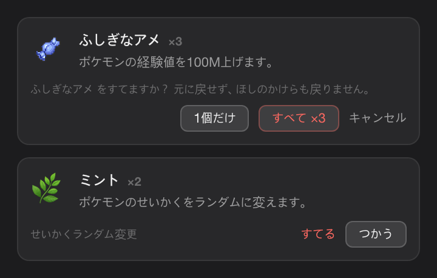
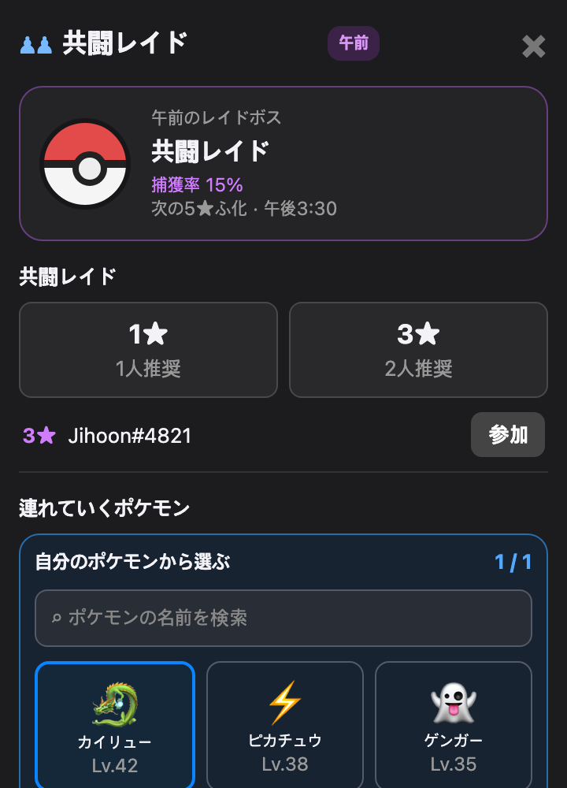
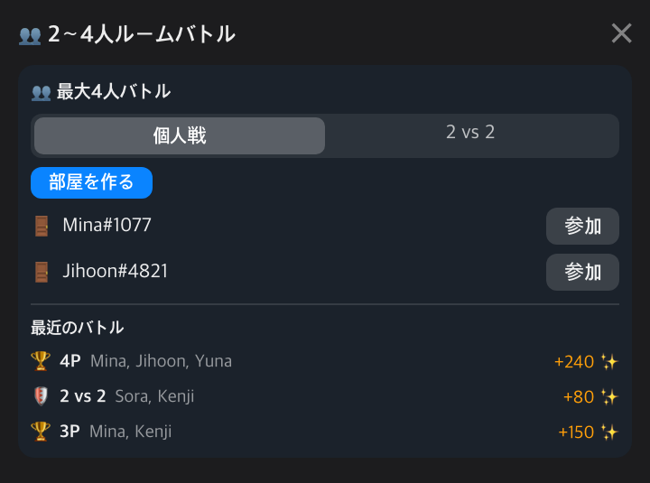
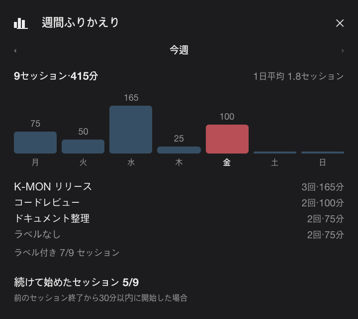

<div align="center">


# Pokédoro · ポケドーロ

**ポモドーロ集中とポケモンの冒険を組み合わせた macOS メニューバーゲーム。**

[](https://www.apple.com/macos/)
[](https://swift.org)
[](LICENSE)

[English](README.en.md) · [한국어](README.md) · **日本語**

</div>

Pokédoro は集中している間にパートナーのポケモンを冒険へ送り、集めたポケモンでバトルやポケスロンを楽しむメニューバーアプリです。普段はメニューバーに「休憩中」またはタイマーだけが表示され、作業中にも自然に使えます。

> 非公式・非商用のポケモンファンプロジェクトです。ポケモンのデータとスプライトは実行時に [PokéAPI](https://pokeapi.co/) から取得します。

## 基本の流れ

1. 25・50・90分から集中時間を選ぶと、現在のパートナーが同じ時間の冒険へ出発します。
2. 冒険が完了したら報酬を受け取ります。受け取り時に経験値とほしのかけらを獲得し、長い集中ほど報酬が大きくなります。アプリを開いた時間は記録されますが、ほしのかけらが自動で入ることはありません。
3. 完了したセッションではタマゴのかけらを得られ、不思議なタマゴを見つけることもあります。かけら10個でタマゴ1個になり、その日の最初の冒険ではかけらを1個追加で獲得し、週に10回の冒険でボーナスタマゴを得ます。
4. 経験値でパートナーを育て、ほしのかけらはショップやランクバトルの賭け金に使います。ホームには冒険の受け取り・集中時間・卒業を数えるデイリー／ウィークリーミッションがあり、図鑑では種・タイプ・色違いの収集目標も達成できます。
5. 終えたセッションは日付ごとの記録に残ります（90日分）。開始時に一行のラベル（最大40文字）を付けると、その日の記録と週間ふりかえりで「何に集中したか」も一緒に見えます。

セッションの合間には5分の休憩が入り、4セッションごとに15分の長い休憩になります。休憩が終わると次のセッションへ呼びかけますが、**自動では始めません** — 席を外している間に積み上がった記録は、実際の集中と無関係になるからです。1日の目標は既定で4セッション、1〜12の範囲で変更できます。週間ふりかえりでは曜日ごとの棒グラフ、ラベルごとの合計、1日平均、前のセッションから続けて始めたセッション数を確認できます。

集中中は「おやすみモード」を有効にできます。システム通知、フローティングペット、受信したバトル申し込みを止めます。

## バトルとポケスロン

- **LAN バトル** — Bonjour で同じローカルネットワークの相手を見つけ、申し込みを送ります。相手は手動で承諾します。申し込みでは通知が出せ、バトル中はウィンドウが固定表示されます。
- **CPU 練習とランク戦** — CPU 相手に 1対1・3対3・6対6を練習でき、出すポケモンと順番を選べます。LAN ランク戦は Lv.50 に補正され、CPU 練習は育てたレベルで戦います。
- **バトルのルール** — タイプ相性、タイプ一致、物理・特殊能力、命中、急所、PP、わざの優先度、6種の状態異常、混乱に対応しています。
- **ジムと能力ランク変化** — 8つのタイプジムに3対3で挑戦します。初勝利ごとにほしのかけらとタマゴ1個を受け取り、ドラゴンジムのタマゴは高級以上が保証されます。8つすべてをクリアすると色違いタマゴの保証券を1つ受け取ります。こうげき・ぼうぎょ・とくこう・とくぼう・すばやさ・命中・回避はバトル中に上下し、交代するとリセットされます。
- **チーム戦とターン再生** — LAN バトルも選んだ手持ちと順番で戦えます。確定したターンは一手ずつ再生され、設定で再生速度を選べます。
- **2〜4人ルームバトル** — フレンドタブで部屋を作るか、近くの部屋に参加して2〜4人が同じバトルで戦います。個人戦と2対2のチーム戦から選べ、ホストが開始すると参加者全員が同じバトルを進めます。最近のバトル履歴と、そのとき受け取ったほしのかけらも同じ画面に残ります。
- **オンラインバトルチャット** — 1対1のLANランクバトルと2〜4人のルームバトルでは、戦闘と独立したセッション限定チャットを使えます。最新50件は内部スクロールで確認でき、旧バージョンの1対1相手との対戦ではチャットが無効になります。
- **ジム争奪戦** — 同じネットワークにひとつのジムを置いて競い、勝った人がジムリーダーになります。リーダーは防衛チーム4体を配置し、その4体は育成・ほかのバトル・交換から外れます。自分で戦うかAIに任せるか選べ、バトル画面から次のターン以降で切り替えられます。リーダーが制限時間内に手を選べなかったターンが一度でも出ると、そこからはAI防衛に自動で切り替わり、残りの試合は相性まで見るAIが戦います。挑戦は挑戦者ごとに5分に1回で、対戦中は挑戦できず観戦のみになります。両者ともLv.50に補正され、防衛に成功するとほしのかけらを獲得します（3連続ごとにボーナス、1日の上限あり）。
- **ポケスロン：チェンジリレー** — ひとりで練習、またはローカルネットワークで最大4人のレースができます。`→`で走り、`↑`・`↓`でレーンを替え、障害物を避け、`C`でポケモンを交代します。
- **共闘レイド** — 同じネットワークのトレーナーと一緒に今日のボスを一体倒します。1★・3★はいつでも開けますが、5★は1日3回決まった時刻にだけ出現します(15分前に通知)。出すポケモンはレイド画面で選び、その選択は代表ポケモンとして保存されてほかの対戦にも反映されます。精算は貢献度・残りターン・生存者数で決まり、報酬は1日1回だけ受け取れます。ソロ周回は基本報酬だけで、貢献度・残りターン・生存者のボーナスは2人からつきます。3★以上を2人以上で倒すと、最後まで生き残った参加者の中から抽選で1人がボスを連れ帰ります(捕獲は1日1匹)。
- **ポケモントーナメント** — 同じネットワークの2〜8人がトーナメント表で戦います。候補6匹を公開したうえで出場3匹を確定し、全員Lv.50で対戦します。優勝者はタマゴを受け取り(参加者5人から高級、7人から希少が保証されます)、2位12,000・3〜4位7,000・5〜8位3,000のほしのかけらが順位に応じて支給されます。
- **ポケモン交換市場** — 複数のポケモンをまとめて出品し、近くのトレーナーからポケモンかほしのかけらの提案を受け取ります。届いた提案は一覧で見比べて承認または拒否でき、星をつけたポケモンは出品できません。

## トレーナーとウェーブラン

- **トレーナーのきせかえ** — ぼうし・かみ・トップス・ボトムス・アクセサリーの5スロットに、ドット絵の衣装12種を重ねて着せられます。8種はショップでほしのかけらと交換し、残り4種は実績の段階報酬で手に入ります。
- **近くのトレーナーカード** — フレンドタブでは相手のきせかえアバター、ランクティアの色、代表ポケモンをまとめて確認できます。
- **ウェーブラン** — 最初のポケモンを選び、30ウェーブに挑みます。4ウェーブごとにボスが現れ（突破すると手持ちのHPが最大70%まで回復）、ウェーブを突破するたびにアイテムを1つ選びます。野生のウェーブではモンスターボール（1ランに5個、最大9個）を投げて相手を捕まえ、手持ちを6匹まで増やせます。野生ウェーブの8回に1回ほど相手が2匹ずつ現れ、そのときは自分も2匹を並べて戦うダブルバトルになります — 枠ごとに行動を選び、じしんのような範囲の広い技はフィールドの複数体を一度に攻撃します。ランは毎回新しく抽選され、1日の回数制限はなく、進行中のランはアプリを終了しても続きから再開できます。

## ツアー

<table>
<tr>
<td width="45%" align="center"></td>
<td width="55%" valign="middle">
<h3>集中、冒険、報酬受け取り</h3>
集中時間を選び、パートナーの冒険を確認し、ホームで完了報酬を受け取ります。
</td>
</tr>
<tr>
<td width="55%" valign="middle">
<h3>ポケモンと図鑑</h3>
手持ちの確認、パートナー交代、わざ・経験値の確認、発見した種の閲覧ができます。名前で検索すれば、ボックス・チーム選択・交換リストから目的のポケモンをすぐに呼び出せます。第1〜9世代の全種に対応しています（アニメーションのない第9世代後半の14種を除く）。大切なポケモンに星を付けると、にがす・交換・出品ができなくなり、見出しの星でおきにいりだけを表示できます。
</td>
<td width="45%" align="center"><br><br><br><br></td>
</tr>
<tr>
<td width="45%" align="center"><br><br></td>
<td width="55%" valign="middle">
<h3>ショップとバッグ</h3>
ほしのかけらでタマゴ、ふしぎなアメ、ミント、つながりのヒモ、進化のいし、わざマシン、ふくを購入します。まとめて持てる品は所持金で買える範囲までまとめ買いでき、バッグではアイテムを使ったり不要なものをすてたりできます。
</td>
</tr>
<tr>
<td width="55%" valign="middle">
<h3>作業と更新の設定</h3>
設定から、おやすみモード、通知、ログイン時の起動、フローティングペット、更新確認を管理できます。更新後の初回起動で新着情報を一度だけ表示し、このウィンドウは設定でオフにできます。
</td>
<td width="45%" align="center"></td>
</tr>
<tr>
<td width="45%" align="center"><br><br><br><br><br><br></td>
<td width="55%" valign="middle">
<h3>きせかえとウェーブラン</h3>
トレーナーの衣装を着替え、ウェーブを突破するたびに報酬アイテムを1つ選びます。相手が2匹現れるウェーブは自分も2匹を並べるダブルバトルになり、枠ごとに行動を選び、範囲の広い技は複数体を一度に攻撃します。野生のウェーブでは捕獲成功率を見てからボールを投げます。
</td>
</tr>
<tr>
<td width="45%" align="center"></td>
<td width="55%" valign="middle">
<h3>共闘レイド</h3>
同じネットワークのトレーナーと一緒に今日のボスを一体倒します。1★・3★はいつでも開け、5★は1日3回決まった時刻に出現します。画面の下で連れていくポケモンを選べ、近くに開いている部屋があれば一覧からすぐ参加できます。
</td>
</tr>
<tr>
<td width="55%" valign="middle">
<h3>2〜4人ルームバトル</h3>
フレンドタブで部屋を作るか、近くの部屋に参加して2〜4人が同じバトルで戦います。個人戦と2対2から選べ、最近のバトル履歴と受け取ったほしのかけらも同じ画面に残ります。
</td>
<td width="45%" align="center"></td>
</tr>
<tr>
<td width="45%" align="center"></td>
<td width="55%" valign="middle">
<h3>集中の記録と週間ふりかえり</h3>
終えたセッションは日付ごとに積み上がり、開始時に付けた一行のラベルもそのまま残ります。週間ふりかえりでは曜日ごとの棒グラフ、ラベルごとの合計、1日平均、続けて始めたセッション数を一画面で見られます。
</td>
</tr>
</table>

> スクリーンショットが最新 UI と異なる場合があります。キャプションは現在のアプリで利用できる機能だけを説明しています。

## インストールとビルド

macOS 14 以降（Apple Silicon または Intel）が必要です。

[Kswiftin/K-MON のリリース](https://github.com/Kswiftin/K-MON/releases)から `Pokedoro.zip` を入手し、解凍して `Pokédoro.app` を `/Applications` にドラッグします。

リリース版には署名があります。初回起動時に Gatekeeper の確認が表示された場合は、次のいずれかで一度開いてください。

- **Finder:** `Pokédoro.app` を Control-クリック → **開く** → ダイアログでもう一度 **開く**。
- **ターミナル:** `xattr -dr com.apple.quarantine /Applications/Pokédoro.app`

バトル申し込み用の通知と、LAN 検出用のローカルネットワークアクセスを、表示されたときに許可してください。許可は一度だけです — リリースはバージョンが変わっても同じ署名 ID を使うため、アップグレードで再度聞かれません。バトルを使わない場合は **設定 → 通知 → バトル招待を受け取る** をオフにすると LAN 探索自体を開始しないため、ローカルネットワーク権限を聞かれません。

ソースからビルドする場合：

```bash
./scripts/create-signing-cert.sh   # 初回のみ — 安定した自己署名 ID
swift build
./scripts/build-app.sh
```

`create-signing-cert.sh` を省くと `build-app.sh` は中断します。ad-hoc 署名はビルドごとにアプリの ID が変わるため、macOS が毎回別のアプリとみなし、権限を最初から聞き直すからです。

`build-app.sh` は `/Applications/Pokédoro.app` を作成・インストールします（インストールを省略した場合は `build/Pokédoro.app`）。

## ターミナルから使う

同じ実行ファイルがターミナルでも動きます。リンクを一つ張ると短い名前で呼べます。

```bash
ln -s "/Applications/Pokédoro.app/Contents/MacOS/PokeTokenBar" /usr/local/bin/pokedoro
```

```
pokedoro status [--oneline]   パートナー・冒険・残高（--oneline はステータスバー用の一行）
pokedoro party | mon | dex    手持ち・個体の詳細・ポケモン図鑑
pokedoro bag | shop | goals   バッグ・ショップの在庫・図鑑の目標と実績
pokedoro watch                全画面のライブ表示
pokedoro start [25|50|90]     集中セッションを開始（stop で終了、claim で受け取り）
pokedoro wave …               ウェーブラン一戦（start · move · ball · pick · route）
pokedoro battle | room …      LAN バトルと部屋（レイド・ジム・トーナメント・ポケスロン・クイズ）
pokedoro trade | auction …    交換の交渉・オークション市場
pokedoro home …               Memory Home — きぶん・記録・家具の配置
pokedoro help                 全コマンド一覧
```

tmux のステータスバーに入れる例です。

```
set -g status-right '#(pokedoro status --oneline)'
```

参照系（`status`・`party`・`wave`・`home`・`gym` など）はセーブを読むだけなので、アプリが起動していなくても答えます。状態を変えるコマンドはすべて**メニューバーアプリに依頼し、アプリが実行します** — セーブに書くプロセスを一つに保つためです。アプリが起動していない場合、その依頼は実行されず、その旨を伝えて終了コード `3` で終わります（入力の誤りは `1`、拒否は `2`）。

取り消せないコマンドは `--yes` を添えたときだけ実行されます — `release`、`wave forfeit`、`battle forfeit`、`room leave`、`room bet`、`trade confirm`、`auction bid` など。

## データ、プライバシー、免責

- 進行データとキャッシュは `~/Library/Application Support/PokeTokenBar/` に保存されます。
- バトル・ポケスロン・交換はローカルネットワークのピアツーピア接続です。種・進化・わざ・スプライトのデータは PokéAPI と関連する静的アセットホストから取得し、GitHub で更新を確認します。
- 交換が成立すると、渡すポケモンが**経験した出来事**（孵化・バトル・進化などの記録）が最大30件まで一緒に渡ります。交換の確認画面が件数を先に知らせます。会話から残った記憶・手書きメモ・隠した記憶・会話の原文は**渡りません。** 思い出は双方で交換が成立した後にのみ送られるため、キャンセルや拒否で終わった交渉では何も出ていきません。
- ソースコードは [MIT License](LICENSE) で提供されます。Pokédoro は任天堂、ゲームフリーク、クリーチャーズ、ポケモン社と提携・承認・後援・許可の関係はありません。ポケモンに関する名称・キャラクター・画像の権利は各権利者に帰属します。
