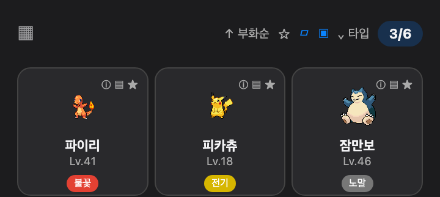
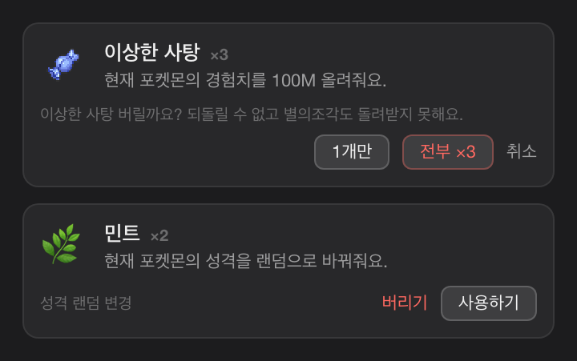
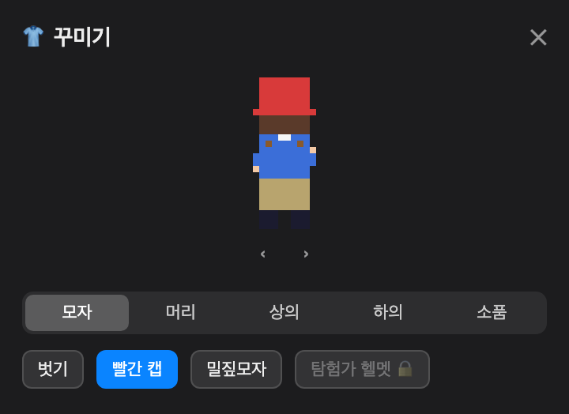
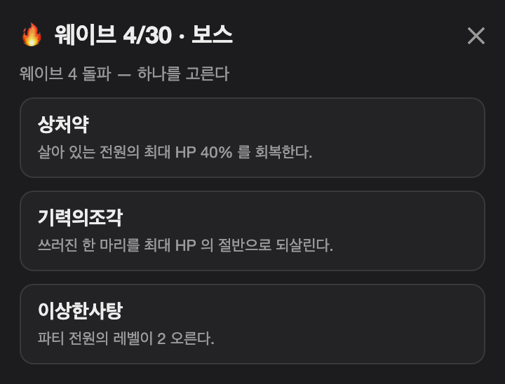
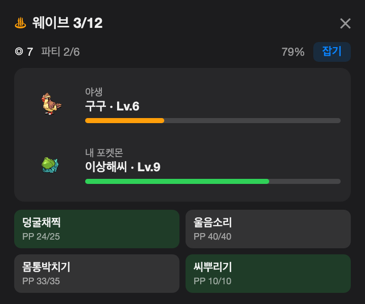
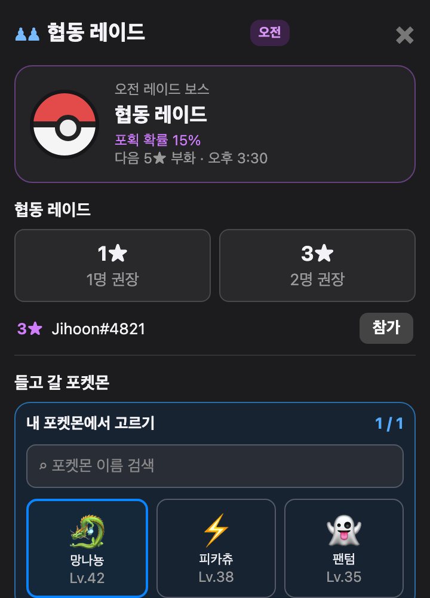
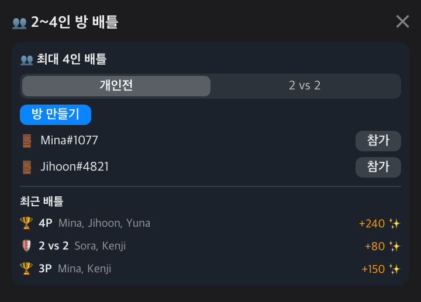
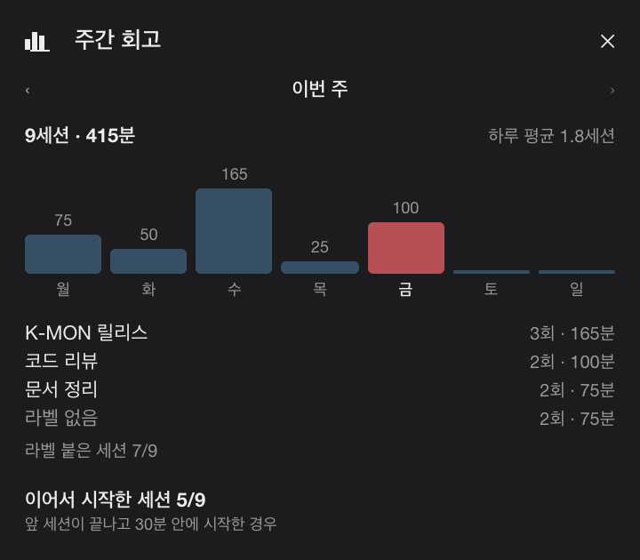

<div align="center">


# Pokédoro · 포케도로

**뽀모도로 집중과 포켓몬 모험을 결합한 macOS 메뉴바 게임**

[](https://www.apple.com/macos/)
[](https://swift.org)
[](LICENSE)

[English](README.en.md) · **한국어** · [日本語](README.ja.md)

</div>

Pokédoro는 집중하는 동안 포켓몬 파트너를 모험에 보내고, 수집한 포켓몬으로 배틀과 포켓슬론을 즐기는 메뉴바 앱입니다. 평소에는 메뉴바에 `휴식 중` 또는 타이머만 표시되어 업무 중에도 자연스럽게 사용할 수 있습니다.

> 비공식·비상업 포켓몬 팬 프로젝트입니다. 포켓몬 데이터와 스프라이트는 런타임에 [PokéAPI](https://pokeapi.co/)에서 불러옵니다.

## 핵심 동작

1. 25분·50분·90분 중 집중 시간을 선택하면 현재 파트너가 같은 시간의 모험을 떠납니다.
2. 모험이 완료되면 보상을 직접 수령합니다. 수령할 때 경험치와 별의조각을 얻으며, 긴 집중일수록 보상이 커집니다. 앱을 켜 둔 시간은 기록되지만 별의조각이 자동으로 지급되지는 않습니다.
3. 완료한 세션에서는 알 조각을 얻고 신비한 알을 발견할 기회도 있습니다. 조각 10개는 알 1개가 되며, 그날 첫 모험에서는 조각을 하나 더 얻고 주간 모험 10회에는 보너스 알을 얻습니다.
4. 경험치로 파트너의 레벨을 올리고, 별의조각은 상점 구매와 랭크 배틀 판돈에 사용합니다. 홈에는 모험 수령·집중 시간·졸업을 세는 일간·주간 미션이, 도감에는 종·타입·이로치 수집 목표가 표시됩니다.
5. 마친 세션은 날짜별 기록에 남습니다(90일치). 시작할 때 한 줄 라벨(최대 40자)을 붙이면 오늘의 기록과 주간 회고에서 무엇에 집중했는지 함께 보입니다.

세션 사이에는 5분 휴식이, 네 세션마다 15분 긴 휴식이 붙습니다. 휴식이 끝나면 다음 세션을 시작하라고
부르지만 **자동으로 시작하지는 않습니다** — 자리를 비운 사이에 쌓인 기록은 실제 집중과 무관해지기
때문입니다. 하루 목표는 기본 4세션이고 1~12 사이에서 바꿉니다. 주간 회고에서는 요일별 막대, 라벨별
합계, 하루 평균, 앞 세션에 이어서 시작한 세션 수를 봅니다.

집중 중에는 방해금지 모드를 켤 수 있습니다. 시스템 알림, 플로팅 펫, 수신 배틀 신청을 막습니다.

## 배틀과 포켓슬론

- **LAN 배틀** — Bonjour로 같은 로컬 네트워크의 사용자를 찾아 신청합니다. 상대는 직접 수락하며, 신청을 받으면 알림을 띄울 수 있습니다. 배틀 중에는 창이 고정되어 열려 있습니다.
- **CPU 연습과 랭크 배틀** — CPU를 상대로 1대1·3대3·6대6을 연습하고 출전 포켓몬과 순서를 고를 수 있습니다. LAN 랭크 배틀은 Lv.50으로 보정되고, CPU 연습은 키운 레벨로 진행합니다.
- **배틀 규칙** — 타입 상성, STAB, 물리·특수 능력치, 명중, 급소, PP, 기술 우선도, 상태이상 6종, 혼란을 반영합니다.
- **체육관과 능력 랭크 변화** — 8개 타입 체육관에 3대3으로 도전합니다. 첫 승리마다 별의조각과 알 1개를 받고, 드래곤 체육관의 알은 고급 이상이 보장됩니다. 여덟 곳을 모두 클리어하면 이로치 알 보증권 1개를 받습니다. 공격·방어·특공·특방·스피드·명중·회피는 배틀 중 오르내리며, 교체하면 초기화됩니다.
- **팀 배틀과 턴 재생** — LAN 배틀도 고른 팀과 순서로 진행합니다. 확정된 턴은 한 수씩 재생되며, 설정에서 재생 속도를 고를 수 있습니다.
- **2~4인 방 배틀** — 친구 탭에서 방을 만들거나 근처 방에 참가해 2~4명이 한 판에서 겨룹니다. 개인전과 2대2 팀전 중에 고르고, 방장이 시작하면 참가자 모두가 같은 배틀을 진행합니다. 최근 배틀 기록과 그때 받은 별의조각도 같은 화면에 남습니다.
- **온라인 배틀 채팅** — 1:1 LAN 랭크배틀과 2~4인 방 배틀에서 전투와 독립된 세션 채팅을 사용합니다. 최근 50개를 내부 스크롤로 확인할 수 있으며, 구버전 1:1 상대와의 배틀에서는 채팅이 비활성화됩니다. 자세한 정책은 [온라인 배틀 자유 채팅](docs/reference/online-battle-chat.md)을 참고하세요.
- **체육관 쟁탈전** — 같은 네트워크에서 하나의 체육관을 두고 겨루고, 이긴 사람이 관장이 됩니다. 관장은 방어팀 4마리를 세우며 그 넷은 육성·다른 배틀·교환에서 빠집니다. 직접 싸우거나 AI에게 맡길 수 있으며, 배틀 화면에서 다음 턴부터 서로 바꿀 수 있습니다. 관장이 제한 시간 안에 수를 내지 못한 턴이 한 번 나오면 그 뒤로는 AI 방어로 자동 전환되어, 남은 판을 상성까지 보는 AI가 이어 싸웁니다. 도전은 사용자별 5분에 한 번입니다. 배틀 중에는 도전이 막히고 관전만 가능합니다. 양쪽 모두 Lv.50으로 보정되며, 방어에 성공하면 별의조각을 받습니다(3연속마다 보너스, 하루 상한 있음).
- **포켓슬론: 체인지릴레이** — 혼자 연습하거나 로컬 네트워크에서 최대 4명이 레이스할 수 있습니다. `→`로 달리고 `↑`·`↓`로 레인을 바꾸며, 장애물을 피하고 `C`로 포켓몬을 교체합니다.
- **협동 레이드** — 같은 네트워크의 트레이너들과 함께 오늘의 보스 하나를 잡습니다. 1★·3★는 아무 때나 열 수 있고, 5★는 하루 세 번 정해진 시각에만 부화합니다(15분 전 알림). 출전 포켓몬은 레이드 화면에서 고르고, 그 선택은 대표 포켓몬으로 저장돼 다른 대전에도 함께 적용됩니다. 정산은 기여도·남은 턴·생존자 수로 계산되며 지급은 하루 한 번입니다. 혼자 도는 판은 티어 기본 보상만 주고 기여도·남은 턴·생존자 항은 두 명부터 붙습니다. 3★ 이상을 둘 이상이 함께 잡으면 끝까지 살아남은 참가자 중 한 명이 추첨으로 보스를 데려가며, 포획은 하루 한 마리입니다.
- **포켓몬 토너먼트** — 같은 네트워크에서 2~8명이 대진표로 겨룹니다. 후보 6마리를 공개한 뒤 그중 출전 3마리를 확정하고 전원 Lv.50으로 싸웁니다. 우승자는 알을 받고(참가자 5명부터 고급, 7명부터 희귀 등급이 보장됩니다), 2위 12,000·3~4위 7,000·5~8위 3,000 별의조각이 순위대로 지급됩니다.
- **포켓몬 경매 시장** — 여러 마리를 한 번에 출품하고, 근처 트레이너가 포켓몬이나 별의조각으로 제안을 보냅니다. 들어온 제안은 목록에서 비교해 수락하거나 거절하며, 별을 단 포켓몬은 출품되지 않습니다.

## 트레이너와 웨이브 런

- **트레이너 꾸미기** — 모자·머리·상의·하의·소품 다섯 슬롯에 도트 의상 12종을 겹쳐 입힙니다. 8종은 상점에서 별의조각으로 사고, 4종은 업적 단계 보상으로 받습니다.
- **근처 트레이너 카드** — 친구 탭에서 상대의 꾸민 아바타, 랭크 티어 색, 대표 포켓몬을 함께 봅니다.
- **웨이브 런** — 첫 포켓몬을 골라 30 웨이브에 도전합니다. 4웨이브마다 보스가 나오고(넘을 때마다 파티 HP 를 70% 까지 회복), 웨이브를 넘길 때마다 아이템 하나를 고릅니다. 야생 웨이브에서는 몬스터볼(판당 5개, 최대 9개)을 던져 상대를 잡아 파티를 여섯 마리까지 늘릴 수 있습니다. 야생 웨이브 여덟 번 중 한 번꼴로 상대가 둘씩 나오고, 이때는 내 포켓몬도 둘이 함께 서는 2대2 전투가 됩니다 — 칸마다 행동을 정하고, 지진처럼 범위가 넓은 기술은 필드의 여러 마리를 한 번에 때립니다. 판은 매번 새로 뽑히고 하루 횟수 제한이 없으며, 진행 중인 판은 앱을 껐다 켜도 이어집니다.

## 화면 둘러보기

<table>
<tr>
<td width="45%" align="center"></td>
<td width="55%" valign="middle">
<h3>집중, 모험, 보상 수령</h3>
집중 시간을 고르고 파트너의 모험을 확인한 다음, 홈에서 완료 보상을 수령합니다.
</td>
</tr>
<tr>
<td width="55%" valign="middle">
<h3>포켓몬과 도감</h3>
보유 포켓몬을 확인하고 파트너를 교체하며, 기술·경험치와 발견한 종을 볼 수 있습니다. 이름으로 검색해 보관함·팀 선택·교환 목록에서 원하는 포켓몬을 바로 찾습니다. 1~9세대 전 종을 다룹니다(움직이는 스프라이트가 없는 9세대 후반 14종은 제외). 아끼는 포켓몬에 별을 달면 놓아주기·교환·경매 출품이 막히고, 머리말의 별로 즐겨찾기만 모아 볼 수 있습니다.
</td>
<td width="45%" align="center"><br><br><br><br></td>
</tr>
<tr>
<td width="45%" align="center"><br><br></td>
<td width="55%" valign="middle">
<h3>상점과 가방</h3>
별의조각으로 알, 이상한 사탕, 민트, 연결의끈, 진화의 돌, 기술머신, 의상을 구매합니다. 재고로 쌓이는 물건은 수량을 정해 한 번에 사고(잔액으로 살 수 있는 최대까지), 가방에서는 아이템을 사용하거나 필요 없는 것을 버립니다.
</td>
</tr>
<tr>
<td width="55%" valign="middle">
<h3>작업과 업데이트 설정</h3>
설정에서 방해금지, 알림, 로그인 시 실행, 플로팅 펫, 업데이트 확인을 관리합니다. 업데이트로 버전이 올라가면 다음 실행에 새로워진 점을 한 번 보여 주며, 이 창은 설정에서 끌 수 있습니다.
</td>
<td width="45%" align="center"></td>
</tr>
<tr>
<td width="45%" align="center"><br><br><br><br><br><br></td>
<td width="55%" valign="middle">
<h3>꾸미기와 웨이브 런</h3>
트레이너에게 의상을 갈아입히고, 웨이브 런에서 판을 넘길 때마다 보상 아이템 하나를 고릅니다. 상대가 둘 나오는 웨이브에서는 내 포켓몬 둘이 함께 서서 칸마다 행동을 정하고, 범위가 넓은 기술은 여러 마리를 한 번에 때립니다. 야생 웨이브에서는 성공률을 보고 몬스터볼을 던져 상대를 파티에 넣습니다.
</td>
</tr>
<tr>
<td width="45%" align="center"></td>
<td width="55%" valign="middle">
<h3>협동 레이드</h3>
같은 네트워크의 트레이너들과 오늘의 보스 하나를 함께 잡습니다. 1★·3★는 아무 때나 열고, 5★는 하루 세 번 정해진 시각에 부화합니다. 화면 아래에서 들고 갈 포켓몬을 고르고, 근처에 열린 방이 있으면 목록에서 바로 참가합니다.
</td>
</tr>
<tr>
<td width="55%" valign="middle">
<h3>2~4인 방 배틀</h3>
친구 탭에서 방을 만들거나 근처 방에 참가해 2~4명이 한 판에서 겨룹니다. 개인전과 2대2 팀전 중에 고르고, 최근 배틀 기록과 그때 받은 별의조각이 같은 화면에 남습니다.
</td>
<td width="45%" align="center"></td>
</tr>
<tr>
<td width="45%" align="center"></td>
<td width="55%" valign="middle">
<h3>집중 기록과 주간 회고</h3>
마친 세션은 날짜별로 쌓이고, 시작할 때 붙인 한 줄 라벨이 함께 남습니다. 주간 회고에서는 요일별 막대와 라벨별 합계, 하루 평균, 앞 세션에 이어서 시작한 세션 수를 한 화면에서 봅니다.
</td>
</tr>
</table>

> 스크린샷은 최신 UI와 다를 수 있습니다. 캡션은 현재 앱에서 확인 가능한 기능만 설명합니다.

## 설치와 빌드

macOS 14 이상(Apple Silicon 또는 Intel)이 필요합니다.

[Kswiftin/K-MON 릴리스](https://github.com/Kswiftin/K-MON/releases)에서 `Pokedoro.zip`을 받아 압축을 풀고 `Pokédoro.app`을 `/Applications`로 드래그합니다.

릴리스 앱에는 서명이 포함되어 있습니다. 최초 실행 시 Gatekeeper 확인이 표시되면 다음 방법 중 하나로 한 번 열어 주세요.

- **Finder:** `Pokédoro.app`을 Control-클릭 → **열기** → 대화상자에서 다시 **열기**.
- **터미널:** `xattr -dr com.apple.quarantine /Applications/Pokédoro.app`

배틀 신청용 알림과 LAN 탐색용 로컬 네트워크 접근 권한은 표시될 때 허용해 주세요. 한 번 허용하면
이후 버전 업그레이드에서 다시 묻지 않습니다 — 릴리스는 버전이 바뀌어도 같은 서명 신원을 씁니다.
배틀을 쓰지 않는다면 **설정 → 알림 → 배틀 신청 받기**를 끄면 LAN 탐색을 아예 시작하지 않아
로컬 네트워크 권한을 묻지 않습니다.

소스에서 빌드하려면 다음을 실행합니다.

```bash
./scripts/create-signing-cert.sh   # 최초 1회 — 안정적 자체 서명 신원
swift build
./scripts/build-app.sh
```

`create-signing-cert.sh` 를 건너뛰면 `build-app.sh` 가 중단합니다. ad-hoc 서명은 빌드마다 앱 신원이
바뀌어 macOS 가 매번 다른 앱으로 보고, 권한을 처음부터 다시 묻기 때문입니다.

`build-app.sh`는 `/Applications/Pokédoro.app`을 생성·설치합니다(설치를 생략하면 `build/Pokédoro.app`).

## 터미널에서 쓰기

같은 실행 파일이 터미널에서도 돕니다. 링크를 하나 걸면 짧게 부를 수 있습니다.

```bash
ln -s "/Applications/Pokédoro.app/Contents/MacOS/PokeTokenBar" /usr/local/bin/pokedoro
```

```
pokedoro status [--oneline]   파트너·모험·잔액 (--oneline 은 상태줄용 한 줄)
pokedoro party | mon | dex    보유 포켓몬 · 개체 상세 · 도감
pokedoro bag | shop | goals   가방 · 상점 재고 · 도감 목표와 업적
pokedoro watch                전체 화면 실시간 보기
pokedoro start [25|50|90]     집중 세션 시작 (stop 으로 끝내고 claim 으로 수령)
pokedoro wave …               웨이브 런 한 판 (start · move · ball · pick · route)
pokedoro battle | room …      LAN 대전, 방 (레이드 · 체육관 · 토너먼트 · 포켓슬론 · 퀴즈)
pokedoro trade | auction …    교환 협상 · 경매 시장
pokedoro home …               Memory Home — 기분 · 기록 · 가구 배치
pokedoro help                 전체 명령 목록
```

tmux 상태줄에 붙이는 예입니다.

```
set -g status-right '#(pokedoro status --oneline)'
```

조회(`status`·`party`·`wave`·`home`·`gym`…)는 세이브를 읽기만 하므로 앱이 꺼져 있어도 답합니다.
상태를 바꾸는 명령은 전부 **메뉴바 앱에 요청을 보내고 앱이 실행합니다** — 세이브에 쓰는 프로세스를
하나로 두기 위해서입니다. 앱이 꺼져 있으면 그 요청은 실행되지 않고, 그 사실을 알려 준 뒤 종료 코드
`3` 으로 끝납니다(잘못된 입력은 `1`, 거절은 `2`).

되돌릴 수 없는 명령은 `--yes` 를 함께 받아야 실행됩니다 — `release`, `wave forfeit`,
`battle forfeit`, `room leave`, `room bet`, `trade confirm`, `auction bid` 등.

## 데이터, 개인정보와 면책

- 진행 데이터와 캐시는 `~/Library/Application Support/PokeTokenBar/`에 저장됩니다.
- 배틀과 포켓슬론, 교환은 로컬 네트워크의 피어 투 피어 연결을 사용합니다. 종·진화·기술·스프라이트 데이터는 PokéAPI와 관련 정적 에셋 호스트에서 가져오며, GitHub로 업데이트를 확인합니다.
- 교환이 성사되면 보내는 포켓몬이 **겪은 일**(부화·배틀·진화 같은 기록)이 최대 30개까지 상대에게 함께 갑니다. 교환 확인 화면이 그 개수를 미리 알려 줍니다. 대화에서 남은 기억, 손글씨 메모, 숨긴 기억, 대화 원문은 **가지 않습니다.** 추억은 교환이 양쪽에서 성사된 뒤에만 전송되므로, 취소·거절로 끝난 협상에는 아무것도 나가지 않습니다.
- 소스 코드는 [MIT License](LICENSE)로 제공됩니다. Pokédoro는 닌텐도, 게임프리크, 크리처스, 포켓몬 컴퍼니와 제휴·보증·후원·승인 관계가 없습니다. 포켓몬 관련 이름·캐릭터·이미지의 권리는 각 권리자에게 있습니다.
