# 화면 소개

기능별 규칙은 [기능 안내](features.md)를 참고하세요.

<table>
<tr>
<td width="45%" align="center"></td>
<td width="55%" valign="middle">
<h3>집중, 모험, 보상 수령</h3>
집중 시간을 고르고 파트너의 모험을 확인한 다음, 홈에서 완료 보상을 수령합니다.
</td>
</tr>
<tr>
<td width="55%" valign="middle">
<h3>포켓몬과 도감</h3>
보유 포켓몬을 확인하고 파트너를 교체하며, 기술·경험치와 발견한 종을 볼 수 있습니다. 이름으로 검색해 보관함·팀 선택·교환 목록에서 원하는 포켓몬을 바로 찾고, 영구 도감에 아직 등록되지 않은 포켓몬이나 같은 진화 계보를 가진 중복 포켓몬만 따로 모아 정리할 수도 있습니다. 포켓몬 탭 밖의 선택 목록은 대부분 레벨 내림차순으로 표시되고(팀 고르기는 정렬 버튼으로 가나다순·부화순도 볼 수 있습니다), 경매에 올릴 포켓몬을 고르는 목록만 이름 가나다순입니다. 1~9세대 전 종을 다룹니다(움직이는 스프라이트가 없는 9세대 후반 14종은 제외). 아끼는 포켓몬에 별을 달면 놓아주기·교환·경매 출품이 막히고, 머리말의 별로 즐겨찾기만 모아 볼 수 있습니다. 상세 카드에서는 특성·종족값·기술과 함께 지닌 물건과 테라 타입을 보고, 함께 다니는 포켓몬이면 물건을 벗길 수 있습니다.
</td>
<td width="45%" align="center">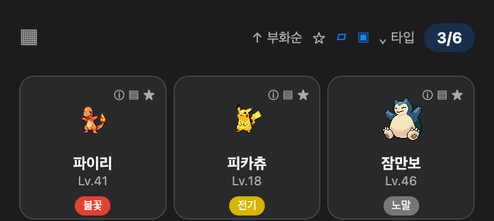  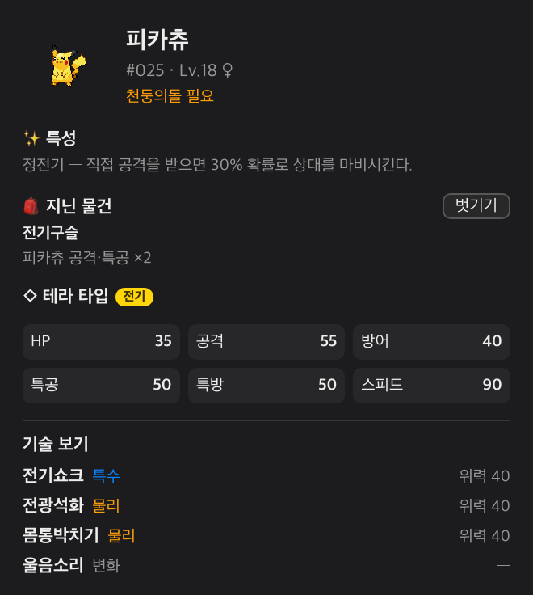    </td>
</tr>
<tr>
<td width="45%" align="center">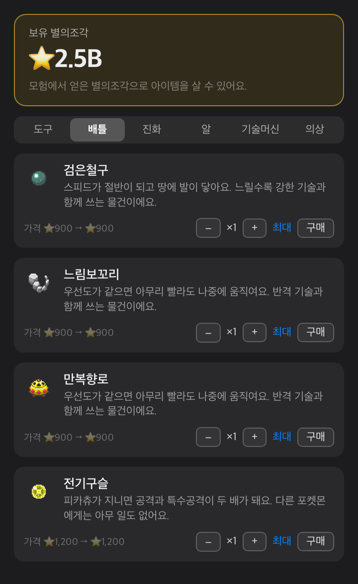  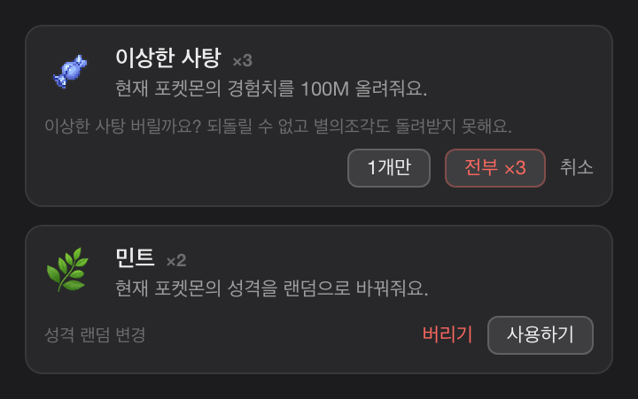</td>
<td width="55%" valign="middle">
<h3>상점과 가방</h3>
별의조각으로 알, 이상한 사탕, 민트, 연결의끈, 진화의 돌, 기술머신, 의상을 구매합니다. 배틀에서 쓰는 지닌 물건 161종은 '배틀' 탭에 따로 모여 있어 소비 아이템과 섞이지 않습니다. 재고로 쌓이는 물건은 수량을 정해 한 번에 사고(잔액으로 살 수 있는 최대까지), 가방에서는 아이템을 사용하거나 필요 없는 것을 버립니다. 홈 화면의 이상한 사탕 아이콘을 누르면 수량을 골라(최대 버튼 포함) 한 번에 먹일 수 있습니다.
</td>
</tr>
<tr>
<td width="55%" valign="middle">
<h3>작업과 업데이트 설정</h3>
설정에서 방해금지, 알림, 로그인 시 실행, 플로팅 펫, 업데이트 확인을 관리합니다. 상단 창을 열고 닫는 전역 단축키도 여기서 지정합니다(기본값은 설정 안 함). 업데이트로 버전이 올라가면 다음 실행에 새로워진 점을 한 번 보여 주며, 이 창은 설정에서 끌 수 있습니다.
</td>
<td width="45%" align="center">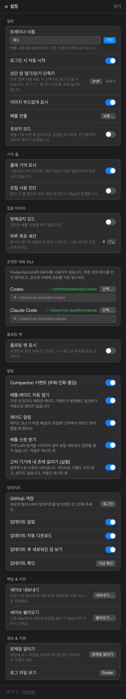</td>
</tr>
<tr>
<td width="45%" align="center">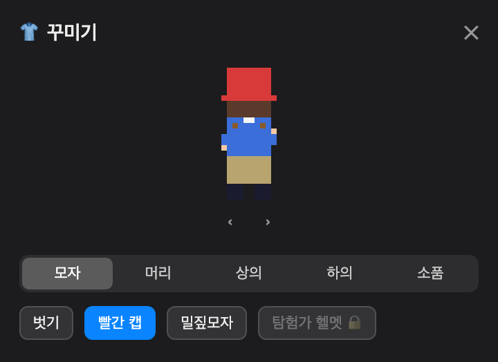  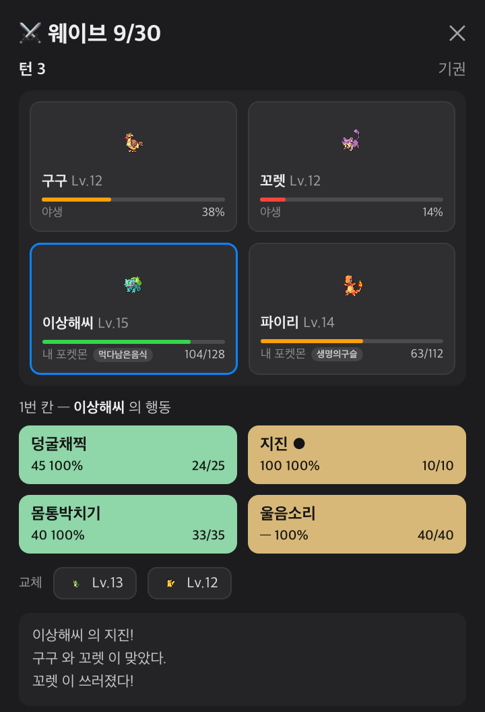  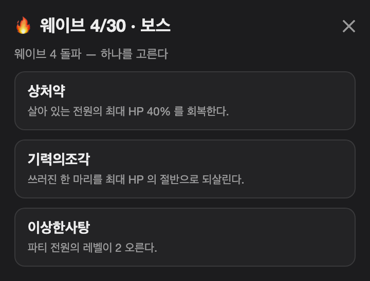  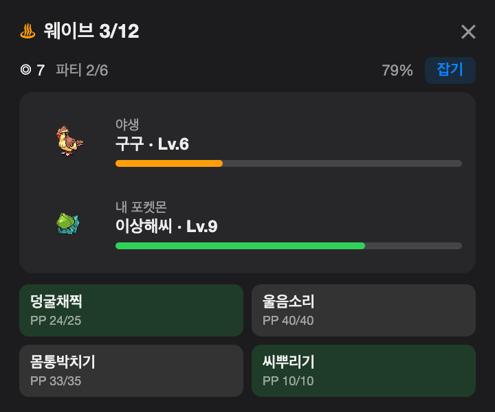</td>
<td width="55%" valign="middle">
<h3>꾸미기와 웨이브 런</h3>
트레이너에게 의상을 갈아입히고, 웨이브 런에서 판을 넘길 때마다 보상 아이템 하나를 고릅니다. 상대가 둘 나오는 웨이브에서는 내 포켓몬 둘이 함께 서서 칸마다 행동을 정하고, 범위가 넓은 기술은 여러 마리를 한 번에 때립니다. 야생 웨이브에서는 성공률을 보고 몬스터볼을 던져 상대를 파티에 넣습니다.
</td>
</tr>
<tr>
<td width="45%" align="center">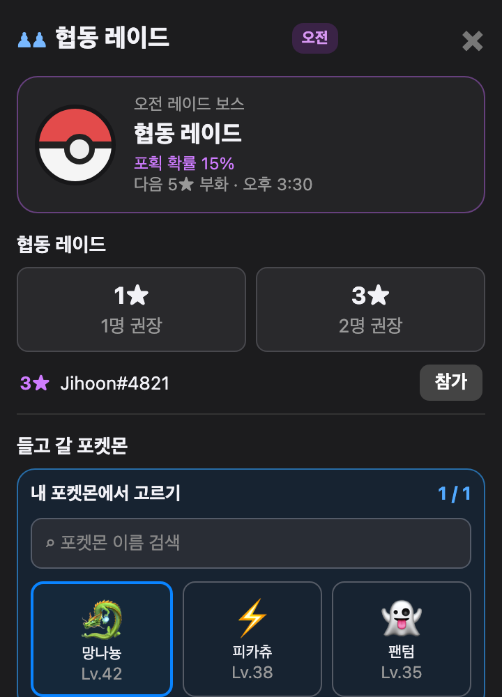</td>
<td width="55%" valign="middle">
<h3>협동 레이드</h3>
같은 네트워크의 트레이너들과 보스를 함께 잡습니다. 오전과 오후는 물론 티어마다도 다른 보스가 등장하며(1★ 고급·3★ 희귀·5★ 전설), 성공 보상은 시간대·티어마다 한 번씩 받을 수 있습니다. 1★·3★·5★ 모두 상시 열려 있습니다. 6★ 주간 레이드는 그 주 내내 같은 보스가 고정되고 항상 이로치로 등장하며, 오전·오후 구분 없이 하루 두 번까지 도전 가치가 있습니다. 화면 아래에서 들고 갈 포켓몬을 고르고, 근처에 열린 방이 있으면 목록에서 바로 참가합니다.
</td>
</tr>
<tr>
<td width="55%" valign="middle">
<h3>2~4인 방 배틀</h3>
친구 탭에서 방을 만들거나 근처 방에 참가해 2~4명이 한 판에서 겨룹니다. 개인전과 2대2 팀전 중에 고르고, 로비에서 참가자·관전자가 채팅하며 준비할 수 있습니다. 대기 중 대화는 배틀 시작 후에도 이어지고, 최근 배틀 기록과 그때 받은 별의조각이 같은 화면에 남습니다.
</td>
<td width="45%" align="center">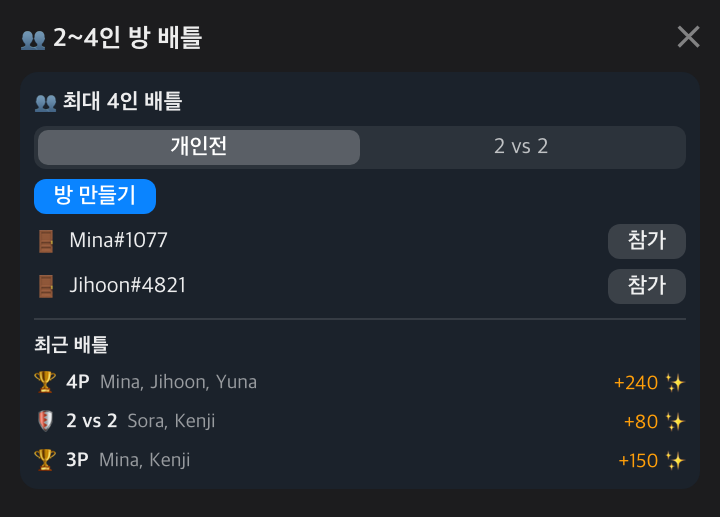</td>
</tr>
<tr>
<td width="45%" align="center">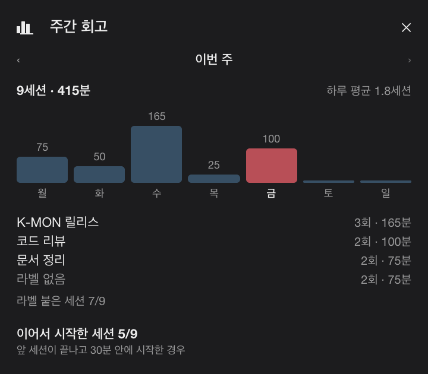</td>
<td width="55%" valign="middle">
<h3>집중 기록과 주간 회고</h3>
마친 세션은 날짜별로 쌓이고, 시작할 때 붙인 한 줄 라벨이 함께 남습니다. 주간 회고에서는 요일별 막대와 라벨별 합계, 하루 평균, 앞 세션에 이어서 시작한 세션 수를 한 화면에서 봅니다.
</td>
</tr>
<tr>
<td width="45%" align="center">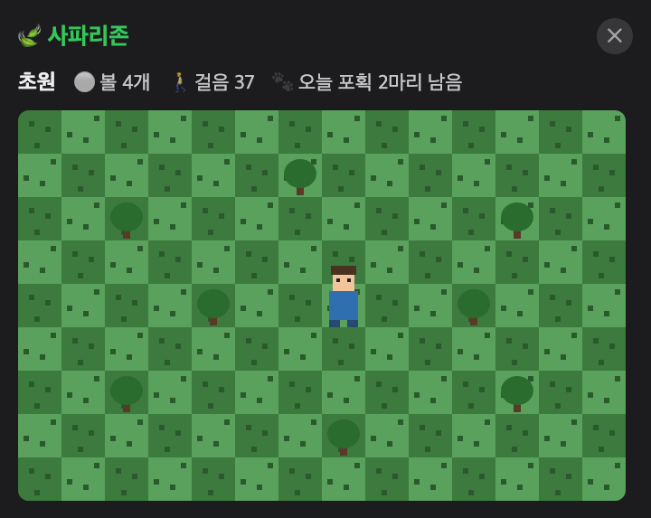  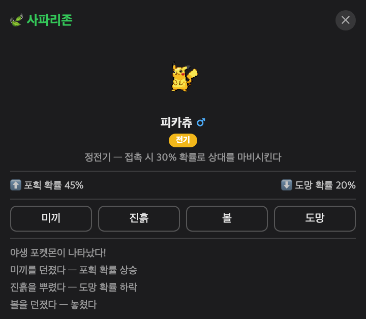</td>
<td width="55%" valign="middle">
<h3>사파리존</h3>
방향키로 벌판을 걸어 다니며 야생 포켓몬을 찾습니다. 조우하면 미끼·진흙·볼·도망 중 골라 대응하고, 상대의 성별·타입·특성을 미리 확인할 수 있습니다.
</td>
</tr>
<tr>
<td width="55%" valign="middle">
<h3>포코피아 마을</h3>
변신할 종을 이름·도감 번호로 검색하고 지형으로 거른 뒤, 그 타입에 맞는 지형을 밉니다. 창 너비에 맞춰 지도와 상세 정보를 배치하고, 주민·서식지 항목을 접고 펼치며 진행도와 입주 조건을 확인합니다. 편집 결과는 지도 위치를 움직이지 않는 안내 영역에 표시되며, ⌘Z·⇧⌘Z로 되돌리거나 다시 적용할 수 있습니다. 집중 세션을 마칠 때마다 마을 환경에 맞는 포켓몬이 찾아와 정착합니다.
</td>
<td width="45%" align="center">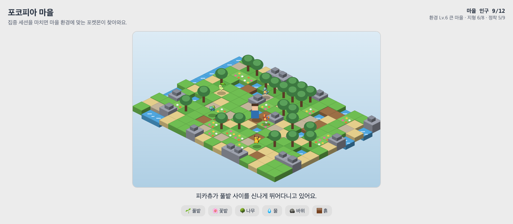</td>
</tr>
</table>

> 스크린샷은 최신 UI와 다를 수 있습니다. 캡션은 현재 앱에서 확인 가능한 기능만 설명합니다.
