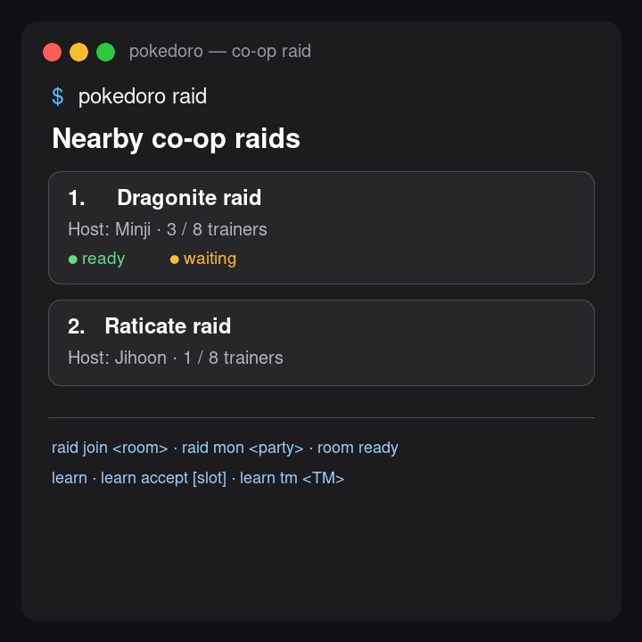

# 터미널 사용법

같은 실행 파일이 터미널에서도 돕니다. 링크를 하나 걸면 짧게 부를 수 있습니다.

```bash
ln -s "/Applications/Pokédoro.app/Contents/MacOS/PokeTokenBar" /usr/local/bin/pokedoro
```

```
pokedoro status [--oneline]   파트너·모험·잔액 (--oneline 은 상태줄용 한 줄)
pokedoro party | mon | dex    보유 포켓몬 · 개체 상세 · 도감
pokedoro bag | shop | goals   가방 · 상점 재고 · 도감 목표와 업적
pokedoro watch                전체 화면 실시간 보기
pokedoro start [25|50|90]     집중 세션 시작 (stop 으로 끝내고 claim 으로 수령)
pokedoro learn …              기술 배우기 · 하트비늘 후보 · 기술머신 사용
pokedoro wave …               웨이브 런 한 판 (start · move · ball · pick · route)
pokedoro raid …               협동 레이드 검색 · 개설 · 참가 · 관전 · 대표 포켓몬 · 준비
pokedoro battle | room …      LAN 대전, 방 로비 준비 · 전투 · 정산
pokedoro gym …                도전 탭 체육관 레이드 목록 · 팀 편성 · 도전
pokedoro gym contest …        LAN 체육관 쟁탈전 검색 · 개설 · 도전 · 관전 · 운영
pokedoro trade | auction …    교환 협상 · 경매 시장
pokedoro home …               Memory Home — 기분 · 기록 · 가구 배치
pokedoro help                 전체 명령 목록
```

<p align="center"></p>

협동 레이드 방을 찾고 참가·준비까지 진행하며, `learn`으로 하트비늘 후보와 기술머신을 포함한 기술 배우기를 끝까지 처리할 수 있습니다.

tmux 상태줄에 붙이는 예입니다.

```
set -g status-right '#(pokedoro status --oneline)'
```

조회(`status`·`party`·`wave`·`home`·`gym`…)는 세이브를 읽기만 하므로 앱이 꺼져 있어도 답합니다.
상태를 바꾸는 명령은 전부 **메뉴바 앱에 요청을 보내고 앱이 실행합니다** — 세이브에 쓰는 프로세스를
하나로 두기 위해서입니다. 앱이 꺼져 있으면 그 요청은 실행되지 않고, 그 사실을 알려 준 뒤 종료 코드
`3` 으로 끝납니다(잘못된 입력은 `1`, 거절은 `2`).

되돌릴 수 없는 명령은 `--yes` 를 함께 받아야 실행됩니다 — `release`, `wave forfeit`,
`battle forfeit`, `room leave`, `room bet`, `trade confirm`, `auction bid` 등.

구현과 요청 처리 규칙은 [터미널 프런트엔드](../reference/terminal-frontend.md)를 참고하세요.
