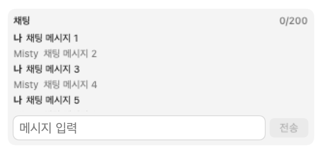

# 온라인 배틀 자유 채팅

## 범위

자유 텍스트 채팅은 1:1 LAN 랭크배틀, 2~4인 온라인 배틀, 그리고 **포켓몬 교환 협상**에서 사용할 수 있습니다. 포켓슬론과 CPU 연습전에는 표시되지 않으며, 채팅은 현재 세션에만 남고 영구 저장되지 않습니다.

## 사용 방법

배틀 로그 아래의 **채팅** 패널에 한 줄을 입력하고 `Return` 또는 **전송**을 누르세요. 메시지를 보내도 기술 선택, 교체, 기권, 턴 타이머 및 전투 RNG에는 영향을 주지 않습니다. 패널에는 최신 50개가 남으며, 과거를 위로 읽는 동안 새 메시지가 오면 자동 스크롤 대신 새 메시지 수가 표시됩니다.

## 제한과 개인정보

- 앞뒤 공백과 줄바꿈은 한 칸으로 정리하며, 비어 있는 메시지와 200자 초과 메시지는 보내지지 않습니다.
- 발신자별로 최대 3개를 즉시 보낼 수 있고, 이후 초당 1개씩 전송 여유가 회복됩니다.
- 방 배틀에서는 호스트가 연결의 참가자 ID와 메시지 발신자를 대조한 뒤, 배틀 중인 방의 정상 메시지만 전체 참가자와 관전자에게 전달합니다.
- 메시지와 속도 제한 상태는 **세션이 끝날 때** 버립니다 — 1:1 배틀은 결과를 확인하는 시점, 방 배틀은 배틀 시작·방 퇴장 시점입니다. 연결이 닫히면 입력만 잠기고 이미 주고받은 대화는 결과 화면으로 넘어갈 때까지 남습니다(배틀이 끝나는 순간 소켓이 먼저 닫히는데, 마지막 턴 연출 동안 화면은 아직 대전 화면입니다). 서버 저장, 신고·차단, 욕설 필터링은 제공하지 않습니다.

## 호환성

1:1 LAN 배틀은 채팅 지원 여부를 신청·수락 메시지의 `chatSupported` 로 협상합니다. `rulesVersion` 이 다르면 배틀 자체가 성립하지 않으므로, "상대 앱 버전에서는 채팅을 지원하지 않습니다" 안내는 **같은 `rulesVersion` 을 쓰면서 채팅만 없는 빌드**를 만난 경우에만 나옵니다. 배틀이 끝나 세션이 닫힌 경우는 그 문구가 아니라 "대전이 끝나 채팅이 닫혔습니다" 를 표시합니다 — 두 사유를 한 문구로 합치면 멀쩡한 상대의 버전을 탓합니다.

2~4인 방은 채팅 와이어 계약을 포함하는 프로토콜 v6입니다. 이 모드의 기존 엄격한 입장 호환성 정책에 따라 구버전 방과는 입장할 수 없습니다.

## 교환 협상 채팅

교환은 포켓몬을 서로 올려둔 **협상 화면**에서만 대화가 열립니다. 정규화·200자·발신자별 3연속·최근 50개 보관은 배틀과 같은 정책(`BattleChatPolicy`)을 그대로 씁니다.

- 지원 여부는 신청·수락 프레임의 `chatSupported` 로 협상합니다. 구버전 빌드는 그 키를 보내지 않으므로 `nil`(= 미지원)이 되고, 그때는 입력이 잠긴 채 "상대 앱 버전에서는 채팅을 지원하지 않습니다." 를 표시합니다. **교환 자체는 그대로 됩니다** — 교환 프로토콜 버전은 2 그대로이고, 채팅이 없다고 교환을 막지 않습니다.
- 미지원 상대에게는 `.chat` 프레임을 **보내지 않습니다**. 구버전은 모르는 프레임을 만나면 그 세션의 수신이 멈추기 때문입니다.
- 상대가 보낸 줄은 받는 쪽에서 길이와 정규형을 다시 재고, 표시 이름은 협상 상대 이름으로 덮으며, 속도 제한은 상대가 바꿀 수 없는 키로 셉니다 — 상대가 `senderID` 를 매번 새로 지어내도 연속 3개를 넘기지 못합니다.
- 대화는 교환이 끝나거나 취소돼 세션이 닫힐 때 통째로 사라집니다.

검증은 `Tests/PokeTokenBarTests/TradeChatTests.swift` 입니다 — 구버전 신청 바이트(`chatSupported` 키 없음) 디코드, 신청받는 쪽과 **거는 쪽 양쪽**의 협상 경로, 수신 값 재검증과 속도 제한, 세션 종료 시 소거, 그리고 협상 화면이 패널을 실제로 그리는지(렌더 높이 비교)를 함께 봅니다.

## 검증

`Tests/PokeTokenBarTests/BattleChatTests.swift`는 JSON 왕복, 입력 정규화, 200자 경계, 토큰 버킷, 50개 보관 상한과 프로토콜 버전을 검증하고, 여기에 상태 수명주기 가드를 함께 둡니다 — 소켓 정리가 대화를 지우지 않는지, 잠긴 사유별로 맞는 문구가 나오는지, 새 메시지 개수가 세 언어에서 보간되는지입니다. `BattleFieldTests`는 실제 SwiftUI 렌더링으로 50개 이력이 고정 높이 내부에 남는지 확인하고, 위 PNG를 생성합니다.
