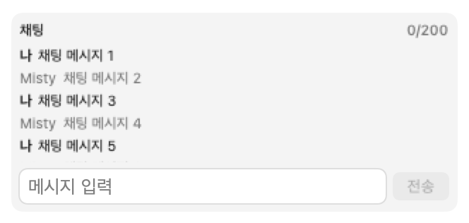

# 온라인 배틀 자유 채팅

## 범위

자유 텍스트 채팅은 1:1 LAN 랭크배틀, 2~4인 온라인 배틀, 레이드·토너먼트·체육관 전투, 그리고 **포켓몬 교환 협상**에서 사용할 수 있습니다. 1:1 배틀의 수락·후보 공개·팀 선택 화면과 방 배틀·레이드·토너먼트·TFT·체육관의 공동 대기 화면에도 같은 채팅 패널이 표시됩니다. 참가자와 관전자 모두 대화할 수 있으며, 대기 중 대화와 속도 제한은 배틀·레이드 시작 후에도 이어집니다. 공용 로비의 대기 채팅 지원 판정은 포켓슬론·OX 퀴즈를 포함한 모든 활동에 적용됩니다. 혼자 진행하는 던전·CPU 연습전에는 표시되지 않으며, 채팅은 현재 세션에만 남고 영구 저장되지 않습니다.

## 사용 방법

대기 화면이나 배틀 로그 아래의 **채팅** 패널에 한 줄을 입력하고 `Return` 또는 **전송**을 누르세요. 턴이 진행돼도 입력 포커스와 작성 내용이 유지되고, 전송 후에도 계속 입력할 수 있습니다. `Esc`로 채팅 입력을 벗어나면 기술 선택 단축키를 사용할 수 있습니다. 이미 열린 팝오버는 배틀 이벤트가 발생해도 현재 화면을 유지합니다. 메시지를 보내도 기술 선택, 교체, 기권, 턴 타이머 및 전투 RNG에는 영향을 주지 않습니다. 패널에는 최신 50개가 남으며, 과거를 위로 읽는 동안 새 메시지가 오면 자동 스크롤 대신 새 메시지 수가 표시됩니다.

터미널에서는 `pokedoro room chat "잘 부탁해요"`로 현재 방에 전송을 요청합니다. `pokedoro room`과 `watch`의 방 화면에 최근 대화 5개가 표시됩니다. 포켓슬론·OX 퀴즈를 포함한 모든 공동 대기실에서 같은 입력 제한과 호스트 검증을 사용하며, 구버전 방이나 종료된 세션에는 전송하지 않습니다.

## 제한과 개인정보

- 앞뒤 공백과 줄바꿈은 한 칸으로 정리하며, 비어 있는 메시지와 200자 초과 메시지는 보내지지 않습니다.
- 발신자별로 최대 3개를 즉시 보낼 수 있고, 이후 초당 1개씩 전송 여유가 회복됩니다.
- 공동 대기실에서는 활동 종류와 무관하게 호스트가 연결의 참가자 ID와 메시지 발신자를 대조한 뒤, 정상 메시지만 전체 참가자와 관전자에게 전달합니다. 기존 배틀·토너먼트 전투 채팅도 같은 검증을 거칩니다.
- 메시지와 속도 제한 상태는 배틀 시작 때 유지하고 **세션이 끝날 때** 버립니다 — 1:1 배틀은 취소·결과 확인 시점, 방 배틀은 방 퇴장·세션 종료 시점입니다. 연결이 닫히면 입력만 잠기고 이미 주고받은 대화는 결과 화면으로 넘어갈 때까지 남습니다(배틀이 끝나는 순간 소켓이 먼저 닫히는데, 마지막 턴 연출 동안 화면은 아직 대전 화면입니다). 서버 저장, 신고·차단, 욕설 필터링은 제공하지 않습니다.

## 호환성

1:1 LAN 배틀은 채팅 지원 여부를 신청·수락 메시지의 `chatSupported` 로 협상합니다. `rulesVersion` 이 다르면 배틀 자체가 성립하지 않으므로, "상대 앱 버전에서는 채팅을 지원하지 않습니다" 안내는 **같은 `rulesVersion` 을 쓰면서 채팅만 없는 빌드**를 만난 경우에만 나옵니다. 배틀이 끝나 세션이 닫힌 경우는 그 문구가 아니라 "대전이 끝나 채팅이 닫혔습니다" 를 표시합니다 — 두 사유를 한 문구로 합치면 멀쩡한 상대의 버전을 탓합니다.

대기 채팅 지원은 별도로 확인합니다. 1:1 신청의 선택 필드 `waitingChatSupported`와 확인 응답 `waitingChatReady`, 방 로비의 선택 필드 `waitingChatSupported`를 사용하며, 지원이 확인되기 전에는 대기 채팅을 보내지 않습니다. 배틀 중 채팅을 지원하더라도 대기 채팅이 없는 구버전 상대에게는 대기 중 입력이 비활성화됩니다.

2~4인 방은 채팅 와이어 계약을 포함하는 프로토콜 v6입니다. 이 모드의 기존 엄격한 입장 호환성 정책에 따라 구버전 방과는 입장할 수 없습니다.

## 교환 협상 채팅

교환은 포켓몬을 서로 올려둔 **협상 화면**에서만 대화가 열립니다. 정규화·200자·발신자별 3연속·최근 50개 보관은 배틀과 같은 정책(`PeerTextPolicy`)을 그대로 씁니다.

- 지원 여부는 신청·수락 프레임의 `chatSupported` 로 협상합니다. 구버전 빌드는 그 키를 보내지 않으므로 `nil`(= 미지원)이 되고, 그때는 입력이 잠긴 채 "상대 앱 버전에서는 채팅을 지원하지 않습니다." 를 표시합니다. **교환 자체는 그대로 됩니다** — 교환 프로토콜 버전은 2 그대로이고, 채팅이 없다고 교환을 막지 않습니다.
- 미지원 상대에게는 `.chat` 프레임을 **보내지 않습니다**. 구버전은 모르는 프레임을 만나면 그 세션의 수신이 멈추기 때문입니다.
- 상대가 보낸 줄은 받는 쪽에서 길이와 정규형을 다시 재고, 표시 이름은 협상 상대 이름으로 덮으며, 속도 제한은 상대가 바꿀 수 없는 키로 셉니다 — 상대가 `senderID` 를 매번 새로 지어내도 연속 3개를 넘기지 못합니다.
- 대화는 교환이 끝나거나 취소돼 세션이 닫힐 때 통째로 사라집니다.

검증은 `Tests/PokeTokenBarTests/TradeChatTests.swift` 입니다 — 구버전 신청 바이트(`chatSupported` 키 없음) 디코드, 신청받는 쪽과 **거는 쪽 양쪽**의 협상 경로, 수신 값 재검증과 속도 제한, 세션 종료 시 소거, 그리고 협상 화면이 패널을 실제로 그리는지(렌더 높이 비교)를 함께 봅니다.

## 검증

`Tests/PokeTokenBarTests/BattleChatTests.swift`는 JSON 왕복, 입력 정규화, 200자 경계, 토큰 버킷, 50개 보관 상한과 프로토콜 버전을 검증하고, 여기에 상태 수명주기 가드를 함께 둡니다 — 소켓 정리가 대화를 지우지 않는지, 잠긴 사유별로 맞는 문구가 나오는지, 새 메시지 개수가 세 언어에서 보간되는지입니다. `BattleFieldTests`는 실제 SwiftUI 렌더링으로 50개 이력이 고정 높이 내부에 남는지 확인하고, 위 PNG를 생성합니다.

`Tests/PokeTokenBarLocalTests/WaitingBattleChatTests.swift`는 모든 로비 활동의 대기 채팅과 관전자 지원, 구버전 호환성, 발신자 검증, 배틀·레이드 전환 시 대화와 속도 제한 유지, 세션 종료 시 초기화를 검증합니다. 실제 레이드·토너먼트·체육관 대기 화면의 입력칸, 구버전 방에서 입력 비활성화, 퇴장 후 패널 제거와 터미널 채팅 명령·내역도 확인합니다. `RoomExecutorTests.swift`는 터미널 전송 요청의 지원 판정과 입력 검증을 확인합니다. 같은 디렉터리의 `BattleChatFocusTests.swift`는 실제 AppKit 입력칸으로 턴 변경 후 포커스와 작성 내용 유지, 연속 전송, Esc를 검증하고, `BattlePresentationTests.swift`는 열린 팝오버에서 화면 이동을 반복하지 않는지 확인합니다.
